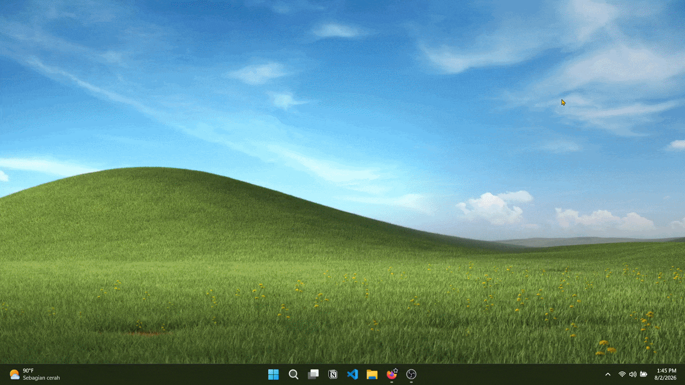
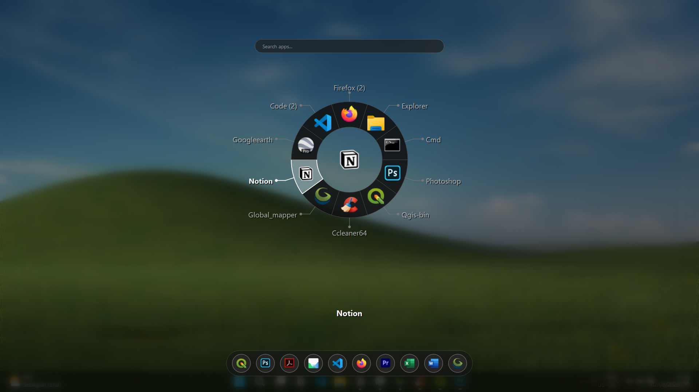
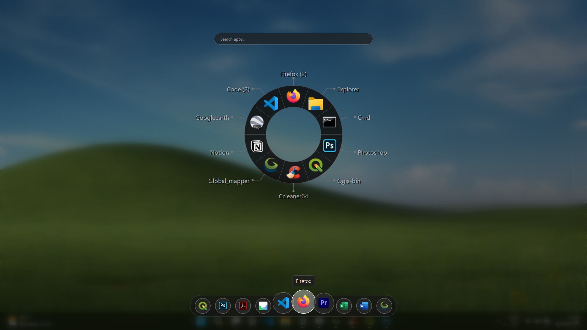
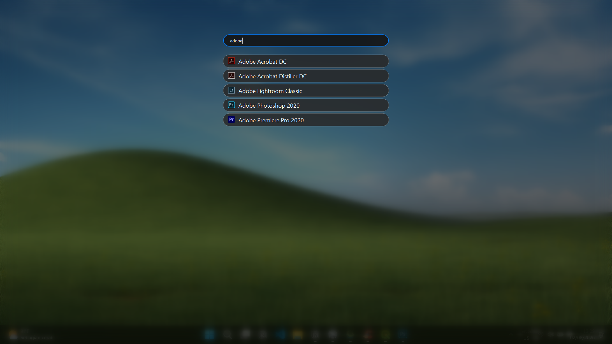

  

<h1 align="center">Orbit</h1>

  <strong>Stop searching for windows. Start switching with muscle memory.</strong>
   
  A radial application switcher for Windows inspired by the weapon wheels in modern games.

  

---

# Why Orbit?

Modern games solved fast selection years ago. Whether you're switching weapons in **Grand Theft Auto V** or navigating inventory wheels in your favorite RPG, everything is built around **spatial memory**. You don't search, you simply know where everything is.

  
   
  <em>Weapon wheels let players select items in a fraction of a second using muscle memory.</em>

Windows still relies on **Alt + Tab**, forcing you to scan rows of window previews every time you switch applications.
Orbit brings that same fast, intuitive radial navigation to your desktop. Instead of searching with your eyes, you build muscle memory.

---

# Features

- 🎯 Radial application launcher
- 📌 Quick Dock for favorite apps
- 🔍 Instant search and filtering
- ⌨️ Mouse and keyboard navigation
- 🪶 Lightweight and always ready

---

# Controls

| Action | Result |
|--------|--------|
| **Alt + Q** | Open Orbit |
| **Mouse + Click** | Launch an app or open its submenu |
| **Type** | Filter applications instantly |
| **Tab** | Switch between Wheel → Dock → Search |
| **← / →** | Select an item on the wheel |
| **Enter** | Launch the selected app or open its submenu |
| **↑ / ↓** | Navigate inside a submenu |
| **Esc** | Close Orbit |

---

# Screenshots

## Radial Wheel

  

## Quick Dock

  

## Search

  

---

# Installation

1. Download the latest release.
2. Run the installer.
3. Press **Alt + Q**.

You're ready to go.

---

# Requirements

- Windows 10 / Windows 11
- ~5 MB RAM

---

# Get Orbit

Ready to switch applications faster?

👉 [Download the latest release](https://github.com/ikbalrahadian/Orbit/releases)

or visit **https://ikbalrahadian.github.io/Orbit/**

---

# Feedback

Have an idea or found a bug?

Open a GitHub Issue or submit a feature request.

---

# License

Copyright © 2026 Orbit.

All rights reserved.
